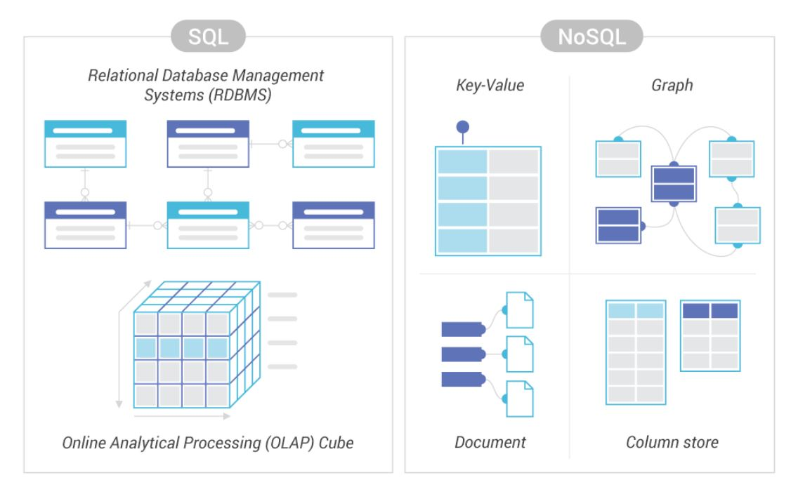
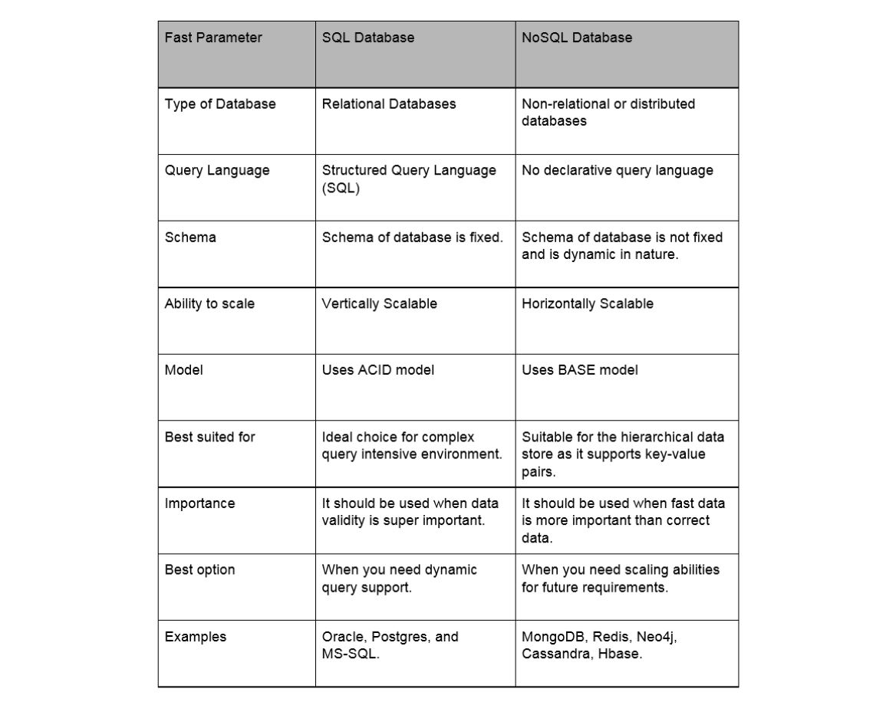

## node.js-pet-mongodb

#### Get animal by id
GET http://localhost:3000/animals/:id   

#### Get animals (pagination, sortBy, filters )
GET http://localhost:3000/animals/?page=1&limit=15&isVaccinated=0&sortBy=age&order=desc|asc&minAge=5  

#### Create animal
POST http://localhost:3000/animals/  
{  
    "name": "Uzbechka",  
    "age": 5,  
    "isVaccinated": false,  
    "gender": "male",  
    "species": "cat"  
}
#### Update animal
PUT http://localhost:3000/animals/:id  
{  
    "name": "AnimalToRemove"  
}  
OR  
{   
    "age": 5  
}  

#### Soft delete animal
DELETE http://localhost:3000/animals/:id

### SQL DB vs noSQL DB

